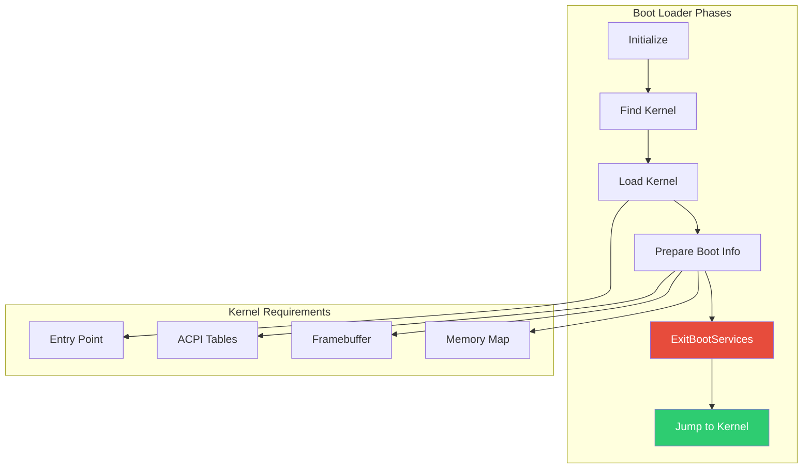

# Chapter 27: Custom Boot Loader

Build a boot loader that loads and executes a kernel, demonstrating the complete boot handoff process including ExitBootServices.

## Overview

### When to Build a Custom Boot Loader

{: .important }
> **Build a custom boot loader when you need to:**
> - Boot a custom OS or kernel with specific requirements
> - Implement specialized boot logic not available in existing loaders
> - Learn the complete UEFI to OS handoff process
> - Support custom kernel formats or protocols

| Use Case | Boot Loader Type | Example |
|:---------|:-----------------|:--------|
| **Custom OS** | Full loader | Hobby OS, embedded Linux |
| **Secure boot chain** | Verified loader | Custom signature verification |
| **Multi-kernel** | Selector + loader | Choose kernel version |
| **Recovery** | Fallback loader | Boot recovery environment |
| **Testing** | Minimal loader | Kernel development |

**Custom Boot Loader vs Existing Solutions:**

| Factor | Custom | GRUB/systemd-boot |
|:-------|:-------|:------------------|
| **Flexibility** | Full control | Configuration-based |
| **Maintenance** | Your code | Community maintained |
| **Features** | What you need | Full-featured |
| **Learning** | Deep understanding | Use existing |
| **Best for** | Custom OS | Standard distros |

**Who Builds Custom Boot Loaders:**
- **OS developers**: Custom kernel boot requirements
- **Embedded developers**: Specialized boot flows
- **Security products**: Secure boot with custom verification
- **Students/hobbyists**: Learning OS development

**Critical Boot Loader Responsibilities:**
- Load kernel to correct memory address
- Pass memory map (GetMemoryMap)
- Provide framebuffer info (from GOP)
- Call ExitBootServices correctly (retry on map change)
- Jump to kernel with proper ABI

### What We're Building

A boot loader (`myloader`) that:
- Loads a kernel from the filesystem
- Sets up the memory map for the kernel
- Calls ExitBootServices properly
- Jumps to the kernel entry point

```
MyLoader v1.0
================================================================================

Searching for kernel...
Found: \EFI\myos\kernel.elf

Loading kernel:
  File size: 2621440 bytes
  Load address: 0x0000000000100000
  Entry point: 0x0000000000100000

Preparing boot information:
  Memory map entries: 42
  Framebuffer: 1920x1080 @ 0x00000000C0000000

Calling ExitBootServices...
Jumping to kernel at 0x0000000000100000...
```

### Architecture



## Initialization

### Project Structure

```
MyLoader/
├── MyLoader.c          # Main boot loader
├── MyLoader.h          # Declarations
├── Elf.c               # ELF loader
├── Elf.h               # ELF structures
├── BootInfo.c          # Boot information
├── BootInfo.h          # Boot info structures
├── Memory.c            # Memory management
├── MyLoader.inf        # Module definition
└── README.md           # Documentation
```

### INF File

```ini
# MyLoader.inf

[Defines]
  INF_VERSION    = 0x00010006
  BASE_NAME      = MyLoader
  FILE_GUID      = FEDCBA98-7654-3210-FEDC-BA9876543210
  MODULE_TYPE    = UEFI_APPLICATION
  VERSION_STRING = 1.0
  ENTRY_POINT    = UefiMain

[Sources]
  MyLoader.c
  MyLoader.h
  Elf.c
  Elf.h
  BootInfo.c
  BootInfo.h
  Memory.c

[Packages]
  MdePkg/MdePkg.dec
  MdeModulePkg/MdeModulePkg.dec

[LibraryClasses]
  UefiApplicationEntryPoint
  UefiLib
  UefiBootServicesTableLib
  UefiRuntimeServicesTableLib
  BaseMemoryLib
  MemoryAllocationLib
  PrintLib
  FileHandleLib
  DevicePathLib

[Protocols]
  gEfiSimpleFileSystemProtocolGuid
  gEfiLoadedImageProtocolGuid
  gEfiGraphicsOutputProtocolGuid
  gEfiAcpiTableProtocolGuid

[Guids]
  gEfiAcpi20TableGuid
  gEfiAcpi10TableGuid
  gEfiFileInfoGuid
```

### Header Files

```c
// MyLoader.h

#ifndef _MY_LOADER_H_
#define _MY_LOADER_H_

#include <Uefi.h>
#include <Library/UefiLib.h>
#include <Library/UefiBootServicesTableLib.h>
#include <Library/UefiRuntimeServicesTableLib.h>
#include <Library/BaseMemoryLib.h>
#include <Library/MemoryAllocationLib.h>
#include <Library/PrintLib.h>
#include <Library/FileHandleLib.h>
#include <Library/DevicePathLib.h>
#include <Protocol/SimpleFileSystem.h>
#include <Protocol/LoadedImage.h>
#include <Protocol/GraphicsOutput.h>
#include <Protocol/AcpiTable.h>
#include <Guid/Acpi.h>
#include <Guid/FileInfo.h>

#define LOADER_VERSION  L"1.0"

// Default kernel path
#define DEFAULT_KERNEL_PATH  L"\\EFI\\myos\\kernel.elf"

// Kernel load address (1MB, typical for x86_64)
#define KERNEL_LOAD_ADDRESS  0x100000

// Boot information passed to kernel
typedef struct {
    UINT64                  Magic;
    UINT64                  Version;

    // Memory map
    UINT64                  MemoryMapAddr;
    UINT64                  MemoryMapSize;
    UINT64                  MemoryDescriptorSize;

    // Framebuffer
    UINT64                  FramebufferAddr;
    UINT32                  FramebufferWidth;
    UINT32                  FramebufferHeight;
    UINT32                  FramebufferPitch;
    UINT32                  FramebufferBpp;

    // ACPI
    UINT64                  AcpiRsdp;

    // Command line
    CHAR8                   CommandLine[256];
} BOOT_INFO;

#define BOOT_INFO_MAGIC  0x4D594F534B52454EULL  // "MYOSKRENEL"

// Function prototypes
EFI_STATUS FindKernel(OUT EFI_FILE_PROTOCOL **KernelFile);
EFI_STATUS LoadKernel(IN EFI_FILE_PROTOCOL *KernelFile, OUT UINT64 *EntryPoint);
EFI_STATUS PrepareBootInfo(OUT BOOT_INFO **Info);
EFI_STATUS ExitAndJump(IN BOOT_INFO *Info, IN UINT64 EntryPoint);

#endif // _MY_LOADER_H_
```

```c
// Elf.h - ELF64 structures

#ifndef _ELF_H_
#define _ELF_H_

#include <Uefi.h>

// ELF identification
#define ELF_MAGIC  0x464C457F  // "\x7FELF"

// ELF types
#define ET_EXEC  2
#define ET_DYN   3

// ELF machine types
#define EM_X86_64  62
#define EM_AARCH64 183

// Program header types
#define PT_NULL    0
#define PT_LOAD    1
#define PT_DYNAMIC 2
#define PT_INTERP  3
#define PT_NOTE    4
#define PT_PHDR    6

// Program header flags
#define PF_X  0x1
#define PF_W  0x2
#define PF_R  0x4

#pragma pack(1)

typedef struct {
    UINT8   e_ident[16];
    UINT16  e_type;
    UINT16  e_machine;
    UINT32  e_version;
    UINT64  e_entry;
    UINT64  e_phoff;
    UINT64  e_shoff;
    UINT32  e_flags;
    UINT16  e_ehsize;
    UINT16  e_phentsize;
    UINT16  e_phnum;
    UINT16  e_shentsize;
    UINT16  e_shnum;
    UINT16  e_shstrndx;
} ELF64_HEADER;

typedef struct {
    UINT32  p_type;
    UINT32  p_flags;
    UINT64  p_offset;
    UINT64  p_vaddr;
    UINT64  p_paddr;
    UINT64  p_filesz;
    UINT64  p_memsz;
    UINT64  p_align;
} ELF64_PROGRAM_HEADER;

#pragma pack()

// ELF loader functions
EFI_STATUS ValidateElf(IN VOID *FileData);
EFI_STATUS LoadElfSegments(IN VOID *FileData, OUT UINT64 *EntryPoint);

#endif // _ELF_H_
```

## Configuration

### Main Boot Loader

```c
// MyLoader.c

#include "MyLoader.h"
#include "Elf.h"

// Global variables
STATIC EFI_HANDLE         gImageHandle;
STATIC EFI_SYSTEM_TABLE   *gSystemTable;

/**
  Boot loader main entry point.
**/
EFI_STATUS
EFIAPI
UefiMain (
    IN EFI_HANDLE        ImageHandle,
    IN EFI_SYSTEM_TABLE  *SystemTable
    )
{
    EFI_STATUS         Status;
    EFI_FILE_PROTOCOL  *KernelFile;
    UINT64             EntryPoint;
    BOOT_INFO          *BootInfo;

    gImageHandle = ImageHandle;
    gSystemTable = SystemTable;

    // Print banner
    gST->ConOut->ClearScreen(gST->ConOut);
    Print(L"MyLoader v%s\n", LOADER_VERSION);
    Print(L"================================================================================\n\n");

    // Step 1: Find kernel
    Print(L"Searching for kernel...\n");
    Status = FindKernel(&KernelFile);
    if (EFI_ERROR(Status)) {
        Print(L"ERROR: Kernel not found: %r\n", Status);
        goto Error;
    }
    Print(L"Found: %s\n\n", DEFAULT_KERNEL_PATH);

    // Step 2: Load kernel
    Print(L"Loading kernel:\n");
    Status = LoadKernel(KernelFile, &EntryPoint);
    KernelFile->Close(KernelFile);

    if (EFI_ERROR(Status)) {
        Print(L"ERROR: Failed to load kernel: %r\n", Status);
        goto Error;
    }
    Print(L"  Entry point: 0x%016lX\n\n", EntryPoint);

    // Step 3: Prepare boot information
    Print(L"Preparing boot information:\n");
    Status = PrepareBootInfo(&BootInfo);
    if (EFI_ERROR(Status)) {
        Print(L"ERROR: Failed to prepare boot info: %r\n", Status);
        goto Error;
    }

    // Step 4: Exit boot services and jump
    Print(L"\nCalling ExitBootServices...\n");
    Print(L"Jumping to kernel at 0x%016lX...\n", EntryPoint);

    // Small delay to show message
    gBS->Stall(500000);

    Status = ExitAndJump(BootInfo, EntryPoint);

    // Should not return
    Print(L"ERROR: Kernel returned or jump failed: %r\n", Status);

Error:
    Print(L"\nPress any key to exit...\n");
    WaitForSingleEvent(gST->ConIn->WaitForKey, 0);
    return Status;
}

/**
  Find the kernel file on the boot volume.
**/
EFI_STATUS
FindKernel (
    OUT EFI_FILE_PROTOCOL  **KernelFile
    )
{
    EFI_STATUS                       Status;
    EFI_LOADED_IMAGE_PROTOCOL        *LoadedImage;
    EFI_SIMPLE_FILE_SYSTEM_PROTOCOL  *FileSystem;
    EFI_FILE_PROTOCOL                *RootDir;

    // Get our loaded image protocol
    Status = gBS->HandleProtocol(
        gImageHandle,
        &gEfiLoadedImageProtocolGuid,
        (VOID **)&LoadedImage
    );

    if (EFI_ERROR(Status)) {
        return Status;
    }

    // Get file system from boot device
    Status = gBS->HandleProtocol(
        LoadedImage->DeviceHandle,
        &gEfiSimpleFileSystemProtocolGuid,
        (VOID **)&FileSystem
    );

    if (EFI_ERROR(Status)) {
        return Status;
    }

    // Open root directory
    Status = FileSystem->OpenVolume(FileSystem, &RootDir);
    if (EFI_ERROR(Status)) {
        return Status;
    }

    // Open kernel file
    Status = RootDir->Open(
        RootDir,
        KernelFile,
        DEFAULT_KERNEL_PATH,
        EFI_FILE_MODE_READ,
        0
    );

    RootDir->Close(RootDir);
    return Status;
}
```

### ELF Loader

```c
// Elf.c

#include "Elf.h"
#include "MyLoader.h"

/**
  Validate ELF header.
**/
EFI_STATUS
ValidateElf (
    IN VOID  *FileData
    )
{
    ELF64_HEADER *Header = (ELF64_HEADER *)FileData;

    // Check magic
    if (*(UINT32 *)Header->e_ident != ELF_MAGIC) {
        Print(L"ERROR: Invalid ELF magic\n");
        return EFI_INVALID_PARAMETER;
    }

    // Check class (64-bit)
    if (Header->e_ident[4] != 2) {
        Print(L"ERROR: Not 64-bit ELF\n");
        return EFI_INVALID_PARAMETER;
    }

    // Check type (executable or shared object)
    if (Header->e_type != ET_EXEC && Header->e_type != ET_DYN) {
        Print(L"ERROR: Not executable ELF\n");
        return EFI_INVALID_PARAMETER;
    }

    // Check machine type
#if defined(MDE_CPU_X64)
    if (Header->e_machine != EM_X86_64) {
        Print(L"ERROR: Not x86_64 ELF\n");
        return EFI_INVALID_PARAMETER;
    }
#elif defined(MDE_CPU_AARCH64)
    if (Header->e_machine != EM_AARCH64) {
        Print(L"ERROR: Not AArch64 ELF\n");
        return EFI_INVALID_PARAMETER;
    }
#endif

    return EFI_SUCCESS;
}

/**
  Load ELF segments into memory.
**/
EFI_STATUS
LoadElfSegments (
    IN  VOID    *FileData,
    OUT UINT64  *EntryPoint
    )
{
    EFI_STATUS           Status;
    ELF64_HEADER         *Header;
    ELF64_PROGRAM_HEADER *Phdr;
    UINTN                Index;

    Header = (ELF64_HEADER *)FileData;
    *EntryPoint = Header->e_entry;

    // Process program headers
    for (Index = 0; Index < Header->e_phnum; Index++) {
        Phdr = (ELF64_PROGRAM_HEADER *)
            ((UINT8 *)FileData + Header->e_phoff +
             Index * Header->e_phentsize);

        if (Phdr->p_type != PT_LOAD) {
            continue;
        }

        // Allocate memory for segment
        UINTN Pages = EFI_SIZE_TO_PAGES(Phdr->p_memsz);
        EFI_PHYSICAL_ADDRESS SegmentAddr = Phdr->p_paddr;

        Status = gBS->AllocatePages(
            AllocateAddress,
            EfiLoaderData,
            Pages,
            &SegmentAddr
        );

        if (EFI_ERROR(Status)) {
            // Try allocating anywhere
            Status = gBS->AllocatePages(
                AllocateAnyPages,
                EfiLoaderData,
                Pages,
                &SegmentAddr
            );

            if (EFI_ERROR(Status)) {
                Print(L"ERROR: Cannot allocate %d pages for segment\n", Pages);
                return Status;
            }
        }

        // Zero the segment
        ZeroMem((VOID *)SegmentAddr, Phdr->p_memsz);

        // Copy segment data
        if (Phdr->p_filesz > 0) {
            CopyMem(
                (VOID *)SegmentAddr,
                (UINT8 *)FileData + Phdr->p_offset,
                Phdr->p_filesz
            );
        }

        Print(L"  Loaded segment: 0x%lX - 0x%lX (%ld bytes)\n",
            SegmentAddr,
            SegmentAddr + Phdr->p_memsz,
            Phdr->p_memsz);
    }

    return EFI_SUCCESS;
}

/**
  Load kernel from file.
**/
EFI_STATUS
LoadKernel (
    IN  EFI_FILE_PROTOCOL  *KernelFile,
    OUT UINT64             *EntryPoint
    )
{
    EFI_STATUS  Status;
    UINTN       FileInfoSize;
    EFI_FILE_INFO *FileInfo;
    VOID        *FileData;
    UINTN       FileSize;

    // Get file info
    FileInfoSize = 0;
    Status = KernelFile->GetInfo(
        KernelFile,
        &gEfiFileInfoGuid,
        &FileInfoSize,
        NULL
    );

    if (Status != EFI_BUFFER_TOO_SMALL) {
        return Status;
    }

    FileInfo = AllocatePool(FileInfoSize);
    if (FileInfo == NULL) {
        return EFI_OUT_OF_RESOURCES;
    }

    Status = KernelFile->GetInfo(
        KernelFile,
        &gEfiFileInfoGuid,
        &FileInfoSize,
        FileInfo
    );

    if (EFI_ERROR(Status)) {
        FreePool(FileInfo);
        return Status;
    }

    FileSize = (UINTN)FileInfo->FileSize;
    Print(L"  File size: %ld bytes\n", FileSize);
    FreePool(FileInfo);

    // Allocate buffer for file
    FileData = AllocatePool(FileSize);
    if (FileData == NULL) {
        return EFI_OUT_OF_RESOURCES;
    }

    // Read file
    Status = KernelFile->Read(KernelFile, &FileSize, FileData);
    if (EFI_ERROR(Status)) {
        FreePool(FileData);
        return Status;
    }

    // Validate ELF
    Status = ValidateElf(FileData);
    if (EFI_ERROR(Status)) {
        FreePool(FileData);
        return Status;
    }

    // Load segments
    Status = LoadElfSegments(FileData, EntryPoint);
    FreePool(FileData);

    return Status;
}
```

### Boot Information

```c
// BootInfo.c

#include "MyLoader.h"

/**
  Prepare boot information for kernel.
**/
EFI_STATUS
PrepareBootInfo (
    OUT BOOT_INFO  **Info
    )
{
    EFI_STATUS                       Status;
    BOOT_INFO                        *BootInfo;
    EFI_GRAPHICS_OUTPUT_PROTOCOL     *Gop;
    VOID                             *Rsdp = NULL;
    UINTN                            Index;

    // Allocate boot info in runtime memory
    BootInfo = AllocateRuntimePool(sizeof(BOOT_INFO));
    if (BootInfo == NULL) {
        return EFI_OUT_OF_RESOURCES;
    }

    ZeroMem(BootInfo, sizeof(BOOT_INFO));
    BootInfo->Magic = BOOT_INFO_MAGIC;
    BootInfo->Version = 1;

    // Get framebuffer info
    Status = gBS->LocateProtocol(
        &gEfiGraphicsOutputProtocolGuid,
        NULL,
        (VOID **)&Gop
    );

    if (!EFI_ERROR(Status)) {
        BootInfo->FramebufferAddr = Gop->Mode->FrameBufferBase;
        BootInfo->FramebufferWidth = Gop->Mode->Info->HorizontalResolution;
        BootInfo->FramebufferHeight = Gop->Mode->Info->VerticalResolution;
        BootInfo->FramebufferPitch = Gop->Mode->Info->PixelsPerScanLine * 4;
        BootInfo->FramebufferBpp = 32;

        Print(L"  Framebuffer: %dx%d @ 0x%lX\n",
            BootInfo->FramebufferWidth,
            BootInfo->FramebufferHeight,
            BootInfo->FramebufferAddr);
    }

    // Find ACPI RSDP
    for (Index = 0; Index < gST->NumberOfTableEntries; Index++) {
        if (CompareGuid(&gST->ConfigurationTable[Index].VendorGuid,
                       &gEfiAcpi20TableGuid)) {
            Rsdp = gST->ConfigurationTable[Index].VendorTable;
            break;
        }
        if (CompareGuid(&gST->ConfigurationTable[Index].VendorGuid,
                       &gEfiAcpi10TableGuid)) {
            Rsdp = gST->ConfigurationTable[Index].VendorTable;
            // Keep looking for ACPI 2.0
        }
    }

    if (Rsdp != NULL) {
        BootInfo->AcpiRsdp = (UINT64)Rsdp;
        Print(L"  ACPI RSDP: 0x%lX\n", BootInfo->AcpiRsdp);
    }

    *Info = BootInfo;
    return EFI_SUCCESS;
}
```

### Exit Boot Services and Jump

```c
// Memory.c

#include "MyLoader.h"

// Kernel entry point type
typedef VOID (*KERNEL_ENTRY)(BOOT_INFO *Info);

/**
  Exit boot services and jump to kernel.
**/
EFI_STATUS
ExitAndJump (
    IN BOOT_INFO  *Info,
    IN UINT64      EntryPoint
    )
{
    EFI_STATUS             Status;
    UINTN                  MemoryMapSize = 0;
    EFI_MEMORY_DESCRIPTOR  *MemoryMap = NULL;
    UINTN                  MapKey;
    UINTN                  DescriptorSize;
    UINT32                 DescriptorVersion;
    KERNEL_ENTRY           KernelEntry;

    // Get memory map size
    Status = gBS->GetMemoryMap(
        &MemoryMapSize,
        MemoryMap,
        &MapKey,
        &DescriptorSize,
        &DescriptorVersion
    );

    if (Status != EFI_BUFFER_TOO_SMALL) {
        return Status;
    }

    // Allocate buffer (with extra space for changes)
    MemoryMapSize += 4 * DescriptorSize;
    MemoryMap = AllocatePool(MemoryMapSize);
    if (MemoryMap == NULL) {
        return EFI_OUT_OF_RESOURCES;
    }

    // Get memory map
    Status = gBS->GetMemoryMap(
        &MemoryMapSize,
        MemoryMap,
        &MapKey,
        &DescriptorSize,
        &DescriptorVersion
    );

    if (EFI_ERROR(Status)) {
        FreePool(MemoryMap);
        return Status;
    }

    // Store memory map in boot info
    Info->MemoryMapAddr = (UINT64)MemoryMap;
    Info->MemoryMapSize = MemoryMapSize;
    Info->MemoryDescriptorSize = DescriptorSize;

    // Exit boot services
    // IMPORTANT: After this, we cannot use any boot services!
    Status = gBS->ExitBootServices(gImageHandle, MapKey);

    if (EFI_ERROR(Status)) {
        // Memory map may have changed, try again
        MemoryMapSize += 4 * DescriptorSize;

        Status = gBS->GetMemoryMap(
            &MemoryMapSize,
            MemoryMap,
            &MapKey,
            &DescriptorSize,
            &DescriptorVersion
        );

        if (EFI_ERROR(Status)) {
            return Status;
        }

        Info->MemoryMapSize = MemoryMapSize;

        Status = gBS->ExitBootServices(gImageHandle, MapKey);
        if (EFI_ERROR(Status)) {
            return Status;
        }
    }

    // ===== POINT OF NO RETURN =====
    // Boot services are no longer available
    // Only runtime services work from here

    // Jump to kernel
    KernelEntry = (KERNEL_ENTRY)EntryPoint;
    KernelEntry(Info);

    // Should never return
    while (1) {
        __asm__ volatile ("hlt");
    }

    return EFI_SUCCESS;
}
```

## Porting Guide

### Platform Considerations

| Aspect | x86_64 | AArch64 |
|--------|--------|---------|
| Entry Point | Standard C call | Use AAPCS64 |
| ELF Machine | EM_X86_64 (62) | EM_AARCH64 (183) |
| Page Size | 4KB | 4KB/16KB/64KB |
| Address Space | 48-bit | 48-bit |

### ARM64 Kernel Jump

```c
// For AArch64
typedef VOID (*KERNEL_ENTRY_ARM64)(
    UINT64 x0,    // Boot info pointer
    UINT64 x1,    // Reserved
    UINT64 x2,    // Reserved
    UINT64 x3     // Reserved
);

VOID
JumpToKernelArm64 (
    IN BOOT_INFO  *Info,
    IN UINT64      EntryPoint
    )
{
    KERNEL_ENTRY_ARM64 Entry = (KERNEL_ENTRY_ARM64)EntryPoint;

    // Disable interrupts
    __asm__ volatile ("msr daifset, #0xf");

    // Jump to kernel
    Entry((UINT64)Info, 0, 0, 0);

    // Should not return
    while (1) {
        __asm__ volatile ("wfi");
    }
}
```

### Minimal Test Kernel

```c
// test_kernel.c - Minimal kernel for testing

#include <stdint.h>

typedef struct {
    uint64_t magic;
    uint64_t version;
    uint64_t memory_map_addr;
    uint64_t memory_map_size;
    uint64_t memory_desc_size;
    uint64_t framebuffer_addr;
    uint32_t framebuffer_width;
    uint32_t framebuffer_height;
    uint32_t framebuffer_pitch;
    uint32_t framebuffer_bpp;
    uint64_t acpi_rsdp;
    char     command_line[256];
} boot_info_t;

void _start(boot_info_t *info) {
    // Write to framebuffer to show we're running
    if (info->framebuffer_addr) {
        uint32_t *fb = (uint32_t *)info->framebuffer_addr;

        // Draw a white rectangle
        for (int y = 100; y < 200; y++) {
            for (int x = 100; x < 300; x++) {
                fb[y * (info->framebuffer_pitch / 4) + x] = 0xFFFFFFFF;
            }
        }
    }

    // Halt
    while (1) {
        __asm__ volatile ("hlt");
    }
}
```

```bash
# Build test kernel
gcc -ffreestanding -nostdlib -no-pie -mcmodel=large \
    -o kernel.elf test_kernel.c -T kernel.ld

# kernel.ld linker script
ENTRY(_start)
SECTIONS {
    . = 0x100000;
    .text : { *(.text) }
    .data : { *(.data) }
    .bss : { *(.bss) }
}
```

## Testing

### Build and Run

```bash
# Build loader
build -a X64 -t GCC5 -p UefiGuidePkg/UefiGuidePkg.dsc

# Create ESP with kernel
mkdir -p esp/EFI/BOOT esp/EFI/myos
cp Build/.../MyLoader.efi esp/EFI/BOOT/BOOTX64.EFI
cp kernel.elf esp/EFI/myos/

# Run QEMU
qemu-system-x86_64 \
    -drive if=pflash,format=raw,file=OVMF_CODE.fd,readonly=on \
    -drive if=pflash,format=raw,file=OVMF_VARS.fd \
    -drive format=raw,file=fat:rw:esp \
    -serial stdio
```

### Expected Output

```
MyLoader v1.0
================================================================================

Searching for kernel...
Found: \EFI\myos\kernel.elf

Loading kernel:
  File size: 4096 bytes
  Loaded segment: 0x100000 - 0x101000 (4096 bytes)
  Entry point: 0x0000000000100000

Preparing boot information:
  Framebuffer: 1024x768 @ 0x00000000C0000000
  ACPI RSDP: 0x00000000BFFE0000

Calling ExitBootServices...
Jumping to kernel at 0x0000000000100000...
```

## Extension Ideas

1. **Multi-boot**: Support multiple kernel paths
2. **Command line**: Parse and pass kernel parameters
3. **Initrd**: Load initial ramdisk
4. **Secure Boot**: Verify kernel signature
5. **Graphics mode**: Set specific video mode before jump

---

{: .note }
> **Source Code**: See [`examples/UefiGuidePkg/BootLoader/`](https://github.com/MichaelTien8901/uefi-guide-tutorial/tree/main/examples/UefiGuidePkg/BootLoader) for the complete buildable example.

## References

- [UEFI ExitBootServices](https://uefi.org/specs/UEFI/2.10/07_Services_Boot_Services.html#efi-boot-services-exitbootservices)
- [ELF Specification](https://refspecs.linuxfoundation.org/elf/elf.pdf)
- [OSDev Boot Protocols](https://wiki.osdev.org/Boot_Protocols)
- [Linux x86 Boot Protocol](https://www.kernel.org/doc/html/latest/arch/x86/boot/)

---

*This concludes Part 5: Practical Projects. Continue to [Appendices](/appendices/) for reference materials.*
