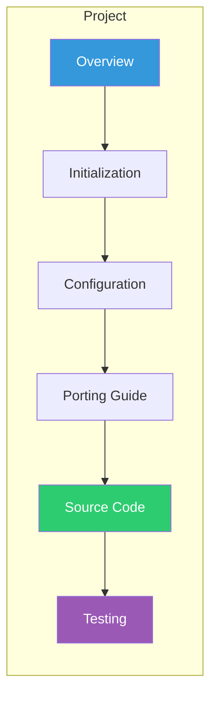

# Part 5: Practical Projects
{: .fs-9 }

Build complete, real-world UEFI applications.
{: .fs-6 .fw-300 }

---

## Projects

| Project | Description | Skills Used |
|:--------|:------------|:------------|
| **[20. Shell Command](20-shell-command.html)** | Custom UEFI Shell command with arguments | ShellPkg, parameters |
| **[21. Graphical Boot Menu](21-boot-menu.html)** | Visual boot option selector | GOP, input handling |
| **[22. Network Application](22-network-app.html)** | HTTP client / network diagnostics | TCP4, HTTP protocols |
| **[23. Boot Loader](23-boot-loader.html)** | Load and execute a kernel | File I/O, ExitBootServices |

## Project Structure

Each project follows this format:



## What You'll Build

### Shell Command
```
Shell> mycommand --help
Usage: mycommand [options] <argument>
  -v, --verbose    Enable verbose output
  -h, --help       Show this help
```

### Graphical Boot Menu
A visual menu with keyboard navigation for selecting boot options.

### Network Application
Download files or perform network diagnostics from UEFI.

### Boot Loader
Load a kernel from disk and transfer control - the foundation of every OS boot.

---

{: .note }
> **Skill Level:** Professional
> **Prerequisites:** All previous parts recommended
