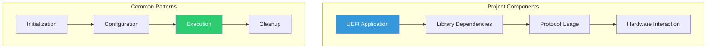
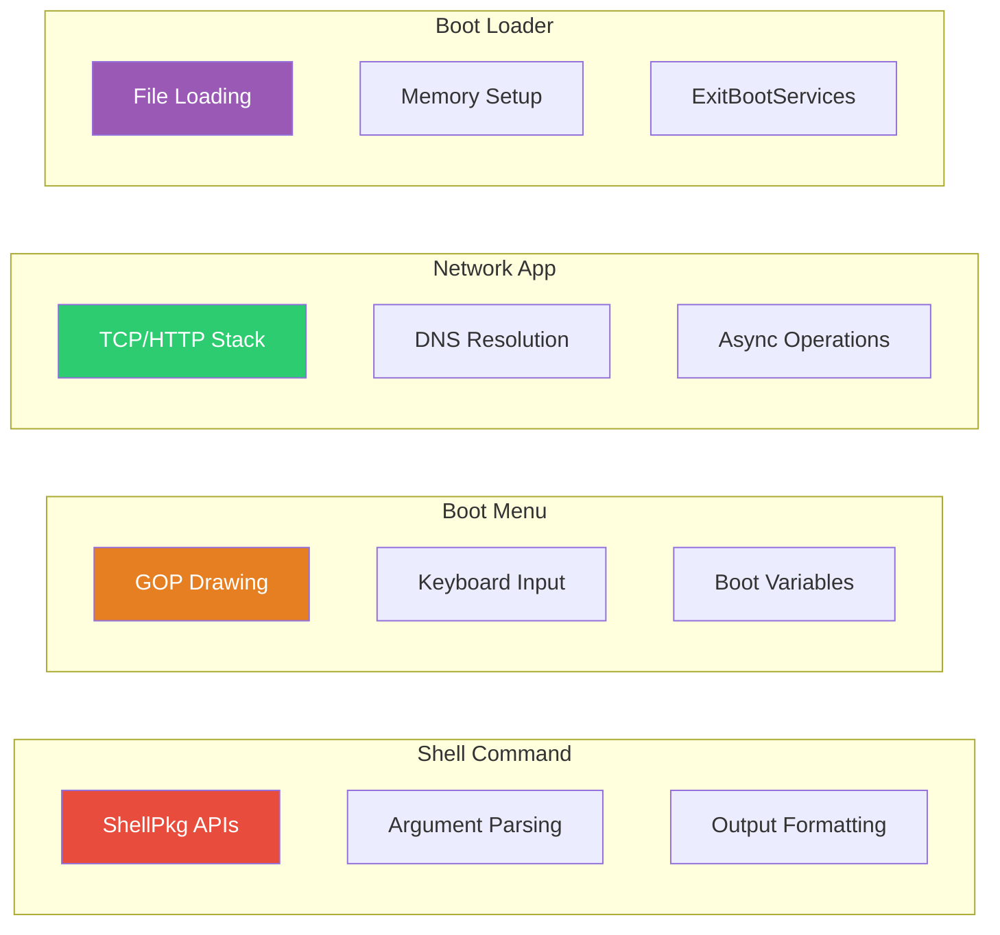
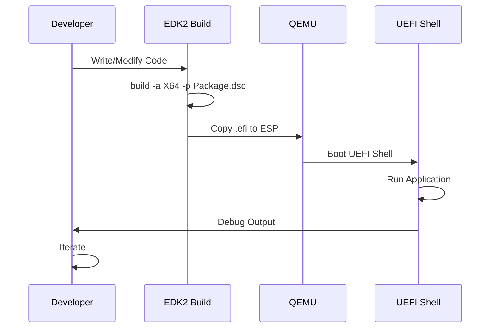

# Part 5: Practical Projects
{: .fs-9 }

Build complete, real-world UEFI applications.
{: .fs-6 .fw-300 }

---

## Projects Overview

| Chapter | Project | Description | Key Skills |
|:--------|:--------|:------------|:-----------|
| **[24. Shell Command](24-shell-command.md)** | Custom Shell Command | Argument parsing, help text, output formatting | ShellPkg, ShellLib |
| **[25. Boot Menu](25-boot-menu.md)** | Graphical Boot Menu | Visual boot selector with keyboard navigation | GOP, input, boot options |
| **[26. Network App](26-network-app.md)** | Network Application | HTTP client and network diagnostics | TCP4, HTTP, DNS |
| **[27. Boot Loader](27-boot-loader.md)** | Custom Boot Loader | Load and execute kernel images | File I/O, ExitBootServices |

## Project Architecture



## Project Structure Template

Each project follows a consistent structure:

```
ProjectName/
├── ProjectName.c          # Main application source
├── ProjectName.h          # Header with declarations
├── ProjectName.inf        # Module information file
├── ProjectNameLib.c       # Support library (optional)
└── README.md              # Project documentation
```

## Skills Matrix



## What You'll Build

### Chapter 24: Custom Shell Command

```
Shell> sysinfo --all
System Information Utility v1.0

Firmware Vendor: EDK II
Firmware Version: 0x00010000
UEFI Revision: 2.80

Memory Map:
  Conventional: 2048 MB
  Reserved: 128 MB
  MMIO: 256 MB

CPU Information:
  Cores: 4
  Architecture: X64
```

### Chapter 25: Graphical Boot Menu

```
┌─────────────────────────────────────┐
│       UEFI Boot Menu v1.0           │
├─────────────────────────────────────┤
│                                     │
│  ► Windows Boot Manager             │
│    Ubuntu                           │
│    Fedora                           │
│    UEFI Shell                       │
│                                     │
│  [↑/↓] Select  [Enter] Boot  [Esc] │
└─────────────────────────────────────┘
```

### Chapter 26: Network Application

```
Shell> httpget http://example.com/file.txt
Resolving example.com... 93.184.216.34
Connecting to 93.184.216.34:80...
GET /file.txt HTTP/1.1
Host: example.com

HTTP/1.1 200 OK
Content-Length: 1234

Downloaded 1234 bytes to file.txt
```

### Chapter 27: Boot Loader

```
MyLoader v1.0
Loading kernel from \EFI\myos\kernel.elf...
  Kernel size: 2.5 MB
  Entry point: 0x100000

Setting up memory map...
Calling ExitBootServices...
Jumping to kernel...
```

## Development Workflow



## Prerequisites

Before starting these projects, ensure you're comfortable with:

- **Part 1**: UEFI application structure and build system
- **Part 2**: Protocols, handles, and memory management
- **Part 3**: Console, graphics, file, and network services

## Testing Environment

All projects can be tested in QEMU:

```bash
# Build project
cd edk2
source edksetup.sh
build -a X64 -t GCC5 -p UefiGuidePkg/UefiGuidePkg.dsc

# Create ESP image
dd if=/dev/zero of=esp.img bs=1M count=64
mkfs.vfat esp.img
mkdir mnt && sudo mount esp.img mnt
sudo mkdir -p mnt/EFI/BOOT
sudo cp Build/UefiGuidePkg/DEBUG_GCC5/X64/Project.efi mnt/EFI/BOOT/
sudo umount mnt

# Run QEMU
qemu-system-x86_64 \
    -drive if=pflash,format=raw,file=OVMF_CODE.fd,readonly=on \
    -drive if=pflash,format=raw,file=OVMF_VARS.fd \
    -drive format=raw,file=esp.img \
    -net none \
    -serial stdio
```

## Extension Ideas

After completing the base projects, consider these extensions:

| Project | Extensions |
|---------|-----------|
| Shell Command | Add configuration file support, colored output |
| Boot Menu | Add timeout countdown, theme support, password protection |
| Network App | Add HTTPS support, download progress bar, resume capability |
| Boot Loader | Add multi-boot support, kernel command line, initrd loading |

---

{: .note }
> **Skill Level:** Professional
> **Prerequisites:** Parts 1-4 recommended
> **Estimated Time:** 2-4 hours per project
